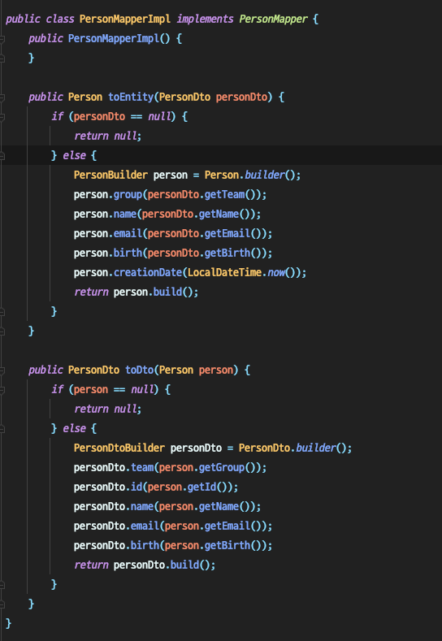

# MapStruct 

## 소개
`DTO` <-> `Entity`간 객체 Mapping을 편하게 도와주는 라이브러리   
비슷한 라이브러리로 [ModelMapper](http://modelmapper.org/)가 있습니다.

> `ModelMapper`는 변환과정에서 리플렉션이 발생합니다.   
> `MapStruct`는 컴파일 시점에 구현체를 만들어내기 떄문에 리플렉션이 발생하지 않아 보다 빠릅니다. 

간단하게 Gradle 프로젝트로 구성

### 1. add dependency
- build.gradle
```gradle
plugins {
    id 'java'
}

ext {
    mapstructVersion = '1.4.2.Final'
    lombokVersion = "1.18.12"
}

group 'io.alxndr'
version '1.0-SNAPSHOT'

repositories {
    mavenCentral()
}

dependencies {
    // 순서 주의!
    // Lombok 사용시 MapStruct가 먼저오게 작성해야함
    implementation "org.mapstruct:mapstruct:${mapstructVersion}"
    annotationProcessor "org.mapstruct:mapstruct-processor:${mapstructVersion}"
    compileOnly group: 'org.projectlombok', name: 'lombok', version: "${lombokVersion}"
    annotationProcessor "org.projectlombok:lombok:${lombokVersion}"
       
    // If you are using mapstruct in test code
    // testAnnotationProcessor "org.mapstruct:mapstruct-processor:1.4.2"

    testCompile group: 'junit', name: 'junit', version: '4.12'
}
```
### 2. Create Test Dto and Model
- Person.java
```java
//@Entity
@Builder
@Getter
@AllArgsConstructor
@NoArgsConstructor
@ToString
public class Person {

    private Long id;

    private String name;

    private String email;

    private String birth;

    private String group;

    private LocalDateTime creationDate;
}
```

- PersonDto.java
```java
@Builder
@Getter
@AllArgsConstructor
@NoArgsConstructor
@ToString
public class PersonDto {
    private Long id;

    private String name;

    private String email;

    private String birth;

    private String team;

}
```
> `Person`은 Entity 역할을한다.

### 3. Mapper 정의
```java
@Mapper
public interface PersonMapper {
    PersonMapper INSTANCE = Mappers.getMapper(PersonMapper.class);

    /**
     * @return {@link Person}
     */
    @Mapping(target = "id", ignore = true)  // 1 
    @Mapping(source = "team", target = "group") // 2 PersonDto.team => Person.group 에 매칭
    @Mapping(target = "creationDate", expression = "java(java.time.LocalDateTime.now())")   // 3 Person.CreationDate LocalDateTime 으로 초기화
    Person toEntity(PersonDto personDto);

    @Mapping(source = "group", target = "team") // 4
    PersonDto toDto(Person person);
}
```
- `toEntity()` : Dto => Entity로 변환
- `toDto()` : Entity => Dto변환

1. `DTO`에서 `Entity`로 변환시 ID는 제외
2. `DTO.team` 을 `Entity.group`으로 매핑
3. `Entity.creationDate` 는 `LocalDateTime.now()`로 초기화
4. `Entity.group`은 `DTO.team` 매핑

> `Mapper`를 만든 후 Project Build를 한번 해준다.



> 이미지 처럼 MapperImpl이 생긴것을 확인할 수 있다.
### 5. TEST
- PersonTest.java
```java
public class PersonTest {

    @Test
    public void dtoToEntity() {
        PersonDto personDto = PersonDto.builder()
                .id(1L)
                .name("Alexander Choi")
                .email("dev.alxndr@gmail.com")
                .birth("1995-01-01")
                .build();

        Person person = PersonMapper.INSTANCE.toEntity(personDto);

        assertEquals(personDto.getEmail(), person.getEmail());
        assertEquals(personDto.getTeam(), person.getGroup());
    }

    @Test
    public void entityToDto() {
        Person person = Person.builder()
                .id(1L)
                .name("Alexander Choi")
                .email("dev.alxndr@gmail.com")
                .birth("1995-01-01")
                .build();

        PersonDto personDto = PersonMapper.INSTANCE.toDto(person);

        assertEquals(personDto.getEmail(), person.getEmail());
        assertEquals(personDto.getTeam(), person.getGroup());
    }
}
```
### References
- [Reference Guide](https://mapstruct.org/documentation/stable/reference/html/)   
- [huisam Blog](https://huisam.tistory.com/entry/mapStruct)
- [Meet up Toast](https://meetup.toast.com/posts/213)
- [ModelMapper vs MapStruct](https://mangchhe.github.io/spring/2021/01/25/ModelMapperAndMapStruct/)
