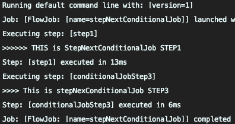
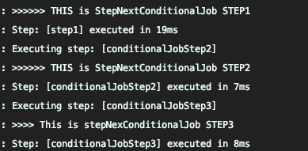
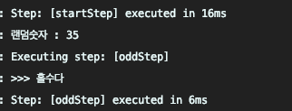

# Spring batch

[What Is Batch](https://github.com/jojoldu/spring-batch-in-action/blob/master/1_%EB%B0%B0%EC%B9%98%EB%9E%80.md)

`@EnableBatchProcessing` : 배치 활성화   

Spring batch는 메타 데이터 테이블이 필요하다.   
Spring Batch의 메타 데이터는 다음과 같은 내용들을 담고 있습니다.

- 이전에 실행한 Job이 어떤 것들이 있는지
- 최근 실패한 Batch Parameter가 어떤것들이 있고, 성공한 Job은 어떤것들이 있는지
- 다시 실행한다면 어디서 부터 시작하면 될지
- 어떤 Job에 어떤 Step들이 있었고, Step들 중 성공한 Step과 실패한 Step들은 어떤것들이 있는지   

`schema-` 로 검색하면 데이터베이스 별로 `sql`을 찾을 수 있음.


[Meta Table](https://github.com/jojoldu/spring-batch-in-action/blob/master/3_%EB%A9%94%ED%83%80%ED%85%8C%EC%9D%B4%EB%B8%94%EC%97%BF%EB%B3%B4%EA%B8%B0.md)


[BatchJobFlow](https://github.com/jojoldu/spring-batch-in-action/blob/master/4_BATCH_JOB_FLOW.md)   

#### 원하는 배치만 실행
- program argument
    - `-- job.name=stepNextJob`

### 성공 조건 별로 Step을 사용하기
-> program argument : --job.name=stepNextConditionalJob version=2

1. step1 실패 시나리오: step1 -> step3   
2. step1 성공 시나리오: step1 -> step2 -> step3

- .on()
    - 캐치할 ExitStatus 지정
    - * 일 경우 모든 ExitStatus가 지정된다.
- to()
    - 다음으로 이동할 Step 지정
- from()
    - 일종의 이벤트 리스너 역할
    - 상태값을 보고 일치하는 상태라면 to()에 포함된 step을 호출합니다.
    - step1의 이벤트 캐치가 FAILED로 되있는 상태에서 추가로 이벤트 캐치하려면 from을 써야만 함
- end()
    - end는 FlowBuilder를 반환하는 end와 FlowBuilder를 종료하는 end 2개가 있음
    - on("*")뒤에 있는 end는 FlowBuilder를 반환하는 end
    - build() 앞에 있는 end는 FlowBuilder를 종료하는 end
    - FlowBuilder를 반환하는 end 사용시 계속해서 from을 이어갈 수 있음

1. `contribution.setExitStatus(ExitStatus.FAILED)`   
`on`이 캐치하는 상태값이 `BatchStatus`가 아닌 `ExitStatus` 값이다.
그래서 분기처리가 필요한 경우 `ExitStatus`를 조정해야한다.

- #### 실행결과   

Batch 1 -> Batch 3이 실행됨

- ExitStatus 주석 후 실행   



```java
public static class OddDecider implements JobExecutionDecider {

    @Override
    public FlowExecutionStatus decide(JobExecution jobExecution, StepExecution stepExecution) {
        Random rand = new Random();
        int randomNumber = rand.nextInt(50) + 1;
        log.info("랜덤숫자 : {}", randomNumber);

        if (randomNumber % 2 == 0) {
            return new FlowExecutionStatus("EVEN");
        } else {
            return new FlowExecutionStatus("ODD");
        }
    }
}
```
- `JobExcutionDecider` 인터페이스를 구현한 `OddDecider`
- 랜덤 값을 발생시켜 짝수/홀수 여부에 따라 다른 상태를 반환
- `step`으로 처리하는게 아니기 떄문에 `ExitStatus`가 아닌 `FlowExcutionStatus`로 상태를 관리
