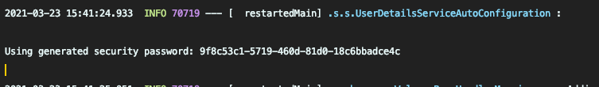

# Spring Security Dependency

- build.gradle
```gradle
dependencies {
    implementation 'org.springframework.boot:spring-boot-starter-security'
}
```

1. 인증 가능
2. 사용자 정보 알 수 있다.
### Security Setting
- SecurityConfig.java
```java
@Configuration
@EnableWebSecurity
@RequiredArgsConstructor
public class SecurityConfig extends WebSecurityConfigurerAdapter {
    @Override
    protected void configure(HttpSecurity http) throws Exception {
        http.authorizeRequests()    // 인가
                    .mvcMatchers("/", "/info").permitAll()  // 1
                    .mvcMatchers("/admin").hasRole("ADMIN") // 2
                    .anyRequest().authenticated();  //3

        http.formLogin()    // 4
                .and()
                .httpBasic();   // 5
    }
}
```
1. `/`, `/info` 접근은 권한이 없어도 접근 가능
2. ADMIN ROLE 을 가진 사용자만 접근 가능
3. 그 외의 모든 접근은 인증 필요
4. `formLogin`, `httpBasic` 인증을 사용


### Sample Controller
- SampleController.java
```java
@Controller
public class SampleController {

    @GetMapping("/")
    public String index(Model model, Principal principal) {
        if (principal == null) {
            model.addAttribute("message", "Hello Spring Security");
        } else {
            model.addAttribute("message", "Hello " + principal.getName());
        }

        return "index";
    }

    @GetMapping("/info")
    public String info(Model model) {
        model.addAttribute("message", "Hello Spring Security");

        return "info";
    }

    @GetMapping("/dashboard")
    public String dashboard(Model model, Principal principal) {
        model.addAttribute("message", "Hello from Dashboard, " + principal.getName());

        return "dashboard";
    }

    @GetMapping("/admin")
    public String admin(Model model, Principal principal) {
        model.addAttribute("message", "Hello Admin, " + principal.getName());

        return "admin";
    }
}
```

서버 구동 후
`/dashboard`로 접근하려 하면 Spring Security의 기본 Login화면이 나오게 됩니다.

- 기본 계정   
    - ID: user    
    - PW: 로그에 나오는 Using generated security password : `~~~~`
    

위의 정보로 로그인하면 접근 할 수 있습니다.
