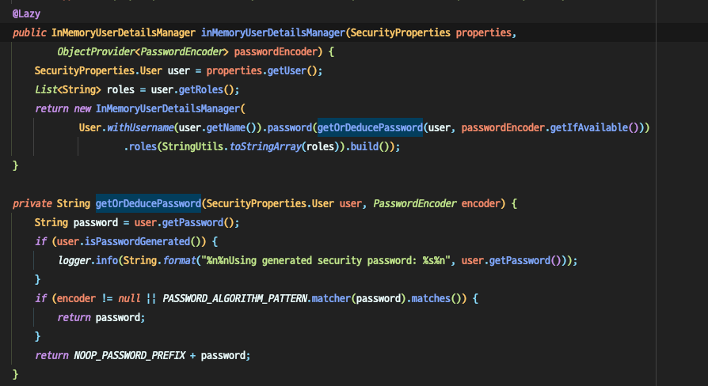

# Inmemory User

- 현재 기본으로 생성되는 유저와 패스워드


log를 확인해보면 `UserDeatilsServiceAutoConfiguration`에서 찍히는걸 확인할 수 있습니다.

- `UserDetailsServiceAutoConfiguration`
 

`User` 정보는 `SecurityProperties`에서 가져오며
`name`, `password`, `role`을 설정 할 수 있습니다.

- properties 수정하여 기본 생성되는 유저 정보 변경하기


`http://localhost:8080/login` 에 접속하여 `properties`에 작성한 ID, Password를 입력해주면 
기존처럼 접속이 가능합니다..


### 문제점
1. 유저 정보가 1개밖에 없다.
2. 소스를 보면 어떤 유저정보가 있는지 확인할 수 있다.

-> 그러므로 유저정보를 properties로 설정하지 않겠습니다.


## 개선

`Security Configration` 파일에서 유저 정보를 추가해주겠습니다.
```java
@Configuration
@EnableWebSecurity
public class SecurityConfig extends WebSecurityConfigurerAdapter {
    //...
    @Override
    protected void configure(AuthenticationManagerBuilder auth) throws Exception {
        auth.inMemoryAuthentication()
                .withUser("alxndr").password("{noop}1234").roles("USER").and()
                .withUser("admin").password("{noop}4321").roles("ADMIN");   // {PREFIX}password
    }
    //...
}
```
`{noop}`은 PasswordEncoder 에게 어떠한 형식으로 암호화되었는지 알려주는 Prefix입니다.
`{bcypt}`, `{sha256}`등이 있습니다.

## 확인
프로젝트를 재시동 후 `localhost:8080/login`으로 접속하여 `alxndr` 계정으로 로그인 후
`/info`를 접속해보면 잘 되는 것을 확인 할 수 있으며,   
`/admin`을 접속할 시 `alxndr` 계정은 `USER` 권한만 가지고 있으므로 접근이 안되는 것을 알 수 있습니다.
   
 `admin` 계정으로 접속하면 모두 접근 할 수 있는 것도 확인 할 수 있습니다.
