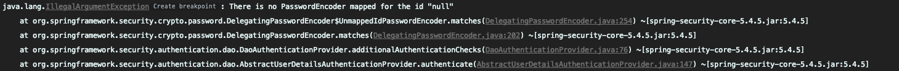
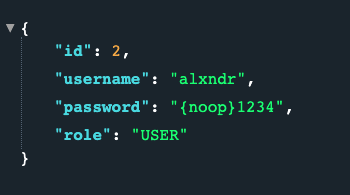

# JPA와 Security 연동

### 이전의 문제점
1. 매번 유저를 추가하는 일이 생길 경우 코드를 수정해야 한다.
2. 수정, 삭제도 마찬가지로 코드를 수정해야 한다.

-> 위와 같은 문제를 DB를 연동하여 유저 정보를 관리할 수 있도록 수정해보겠습니다.
(JPA를 사용하겠습니다.)

## 개선

### JPA 설정
#### dependency 추가 
- build.gradle
```graldle
dependencies {
...
    // JPA
    implementation 'org.springframework.boot:spring-boot-starter-data-jpa'
    // H2
    runtimeOnly 'com.h2database:h2'
...
}
```

#### class 생성


- Account
```java
@Entity
@Getter
@Setter
public class Account {

    @Id @GeneratedValue
    private Long id;
    @Column(unique = true)
    private String username;
    private String password;
    private String role;

}
```

- AccountRepository
```java
@Repository
public interface AccountRepository extends JpaRepository<Account, Long> {
    Account findByUsername(String username);
}
```

- AccountService
```java
@Service
@RequiredArgsConstructor
public class AccountService implements UserDetailsService {

    private final AccountRepository accountRepository;

    @Override
    public UserDetails loadUserByUsername(String username) throws UsernameNotFoundException {
        Account account = accountRepository.findByUsername(username);
        if (account == null) {
            throw new UsernameNotFoundException(username);  // 1
        }

        return User.builder()   // 2
                .username(account.getUsername())
                .password(account.getPassword())
                .roles(account.getRole())
                .build();
    }

    public Account createAccount(Account account) {
        return accountRepository.save(account);
    }

}
```
1. 해당 Username 으로 찾는 유저 정보가 없는 경우 `UsernameNotFoundException`을 터트리도록 합니다.
2. `loadUserByUsername()`은 `UserDeatils`를 리턴하는데 우리가 가진 유저객체는 
`Account`이므로 `UserDetails`를 구현해둔 `User`를 빌드하여 리턴한다


#### 테스트를 위한 회원등록 Controller
- AccountController
```java
@RestController
@RequiredArgsConstructor
public class AccountController {
    private final AccountService accountService;

    @GetMapping("/account/{role}/{username}/{password}")
    public Account createAccount(@ModelAttribute Account account) {
        return accountService.createAccount(account);
    }
}
```
**실제로 회원가입기능을 이런식으로 만들면 안됩니다 간단한 테스트용입니다.**

프로젝트 재시동 후 
- `http://localhost:8080/account/USER/alxndr/1234`   
- `http://localhost:8080/account/ADMIN/admin/1234`
호출하여 유저 정보를 등록해줍니다.

그 후 `/dashboard` 에 접근하여 방금 등록한 정보로 로그인해봅니다.

그러면 에러가 발생하게 되는데

스프링 시큐리티는 특정한 패스워드 패턴을 요구하는데 (`{noop}1234`)
현재 저장된 password는 `123`으로 저장되어 있기 때문에 발생하는 에러입니다.

### 에러 개선
우선은 패스워드를 스프링 시큐리티가 원하는 규격으로 만들어주겠습니다.

- AccountService
```java
public class AccountService implements UserDetailsService {
    ... 생략    
    public Account createAccount(Account account) {
        account.setPassword("{noop}" + account.getPassword());  // 1
        return accountRepository.save(account);
    }
}
```
1. Inmemory user를 저장할 떄 처럼 패스워드 앞에 `{noop}`을 붙여서 저장을 해주도록 하겠습니다.

프로젝트를 재시동 후 다시 한번 
- `http://localhost:8080/account/USER/alxndr/1234`   
- `http://localhost:8080/account/ADMIN/admin/1234`   
회원을 등록해주면 아래와 같이 `{noop}YOUR-PASSWORD`로 저장되고   
`/dashboard`에 접근하여 로그인해보면 정상적으로 동작하는 것을 확인할 수 있습니다.

    


