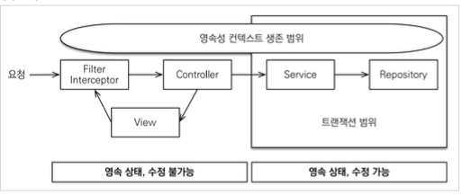
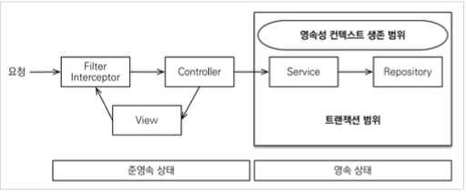

# OSIV와 성능최적화

애플리케이션 로딩 시점 로그
> Warning : spring.jpa.open-in-view is enabled by default. Therefore, database queries may be performed during view rendering. Explicitly configure spring.jpa.open-in-view to disable this warning

`spring.jpa.oepn-in-view` : `true`

### Warning을 남기는 이유가 있다.

`OSIV` 전략은 트랜잭션 시작처럼 최초 데이터베이스 커넥션 시작 시점부터 API 응답이 끝날 때까지 영속성 컨텍스트와 데이터베이스 커넥션을 유지한다. 그래서 `View Template`이나 `Controller`에서 지연 로딩이 가능했던 것이다.   
지연 로딩은 영속성 컨텍스트가 살아있어야 가능하고, 영속성 컨텍스트는 기본적으로 데이터베이스 커넥션을 유지한다. 이것 자체는 큰 장점이다.

   
그런데 이 전략은 오랜시간동안 데이터베이스 커넥션 리소스를 반환하지 않고 사용하기 때문에, 실시간 트래픽이 중료한 애플리케이션에서는 커넥션이 모자랄 수 있다.
-> 결국 `장애`로 이어진다.

## OSIV OFF

`OFF` 상태를 두면 `@Transaction`이 끝나는 시점에 커넥션을 반환한다.
쉽게 말해, Service단에서 영속성 컨텍스트를 날려버리고 영속상태도 유지하지 않는다.
   
OSIV를 끄면 모든 지연로딩은 트랜잭션 안에서 처리해야한다. 

### 커맨드와 쿼리 분리
보통 비지니스 로직은 특정 엔티티 몇개를 등록하거나 수정하는 것이므로 크게 문제가 되지 않는다. 
그런데 복잡한 화면을 출력하기 위한 쿼리는 화면에 맞추어 성능을 최적하는 것이 중요하다.  
하지만 그 복합성에 비해 핵심 비즈니스에 큰 영향을 주는 것은 다르다.

#### 분리
+ `OrderService` 핵심 비즈니스 로직
+ `OrderQueryService` 화면이나 API에 맞춘 서비스 `(주로 읽기 전용)`

> 고객서비스(실시간 API)는 OSIV를 끄고,    
접속자가 많이 없는 ADMIN 같은 BO는 OSIV를 키고 사용해도 괜찮다.