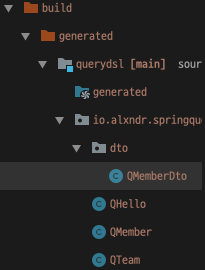

# 프로젝션DTO조회2

`@QueryProjection` 활용

- MemberDto.java
```java
@Data
@NoArgsConstructor
public class MemberDto {

    private String username;
    private int age;

    @QueryProjection
    public MemberDto(String username, int age) {
        this.username = username;
        this.age = age;
    }
}
```
1. 기존 생성자에 `@QueryProjection`
2. `Gradle` -> `Tasks` -> `other` -> `compileQuerydsl`

3. QType Dto확인  



- QuerydslBasicTest.java
```java
@Test
public void findByQuerydslProjection() throws Exception {
    List<MemberDto> result = queryFactory.select(new QMemberDto(member.username, member.age))
            .from(member)
            .fetch();

    for (MemberDto memberDto : result) {
        System.out.println("memberDto = " + memberDto);
    }
    /*
    memberDto = MemberDto(username=member1, age=10)
    memberDto = MemberDto(username=member2, age=20)
    memberDto = MemberDto(username=member3, age=30)
    memberDto = MemberDto(username=member4, age=40)
    */
}
```

기존 생성자 방식과 다른점
1. 생성자 방식은 필드가 추가되면 컴파일 시점에 에러를 잡지못하고 런타임에러가 발생한다.
2. `@QueryProjection` 방식은 컴파일 시점에 에러를 발견할 수 있다.


**단점**
1. QType Dto를 만들어야하는점
2. `MemberDto`가 `Querydsl` 의존성이 생긴다는 점