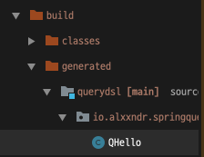

# Querydsl 설정

`85c953a`

- build.gradle
```gradle
plugins {
    id 'org.springframework.boot' version '2.4.1'
    id 'io.spring.dependency-management' version '1.0.10.RELEASE'
    id 'java'
    // querydsl
    id "com.ewerk.gradle.plugins.querydsl" version "1.0.10"
}

group = 'io.alxxndr'
version = '0.0.1-SNAPSHOT'
sourceCompatibility = '11'

configurations {
    compileOnly {
        extendsFrom annotationProcessor
    }
}

repositories {
    mavenCentral()
}

dependencies {
    implementation 'org.springframework.boot:spring-boot-starter-data-jpa'
    implementation 'org.springframework.boot:spring-boot-starter-web'
    //querydsl 추가
    implementation 'com.querydsl:querydsl-jpa'
    compileOnly 'org.projectlombok:lombok'
    runtimeOnly 'com.h2database:h2'
    annotationProcessor 'org.projectlombok:lombok'
    testImplementation ('org.springframework.boot:spring-boot-starter-test') {
        exclude group: 'org.junit.vintage’, module: ‘junit-vintage-engine'
    }
}

test {
    useJUnitPlatform()
}

//querydsl 추가 시작
def querydslDir = "$buildDir/generated/querydsl"
querydsl {
    jpa = true
    querydslSourcesDir = querydslDir
}
sourceSets {
    main.java.srcDir querydslDir
}
configurations {
    querydsl.extendsFrom compileClasspath }
compileQuerydsl {
    options.annotationProcessorPath = configurations.querydsl
}

//querydsl 추가 끝
```

- Compile Querydsl   


- QType Class 확인   



- 기본으로 만들어주는 Test Class에서 설정 제대로 되었나 확인
간단한 Entity 생성
- `Hello.java`
```java
import lombok.Getter;
import lombok.Setter;
import javax.persistence.Entity;
import javax.persistence.GeneratedValue;
import javax.persistence.Id;

@Entity
@Getter @Setter
public class Hello {

    @Id @GeneratedValue
    private Long id;
}
```

- `SpringQuerydslApplicationTests.java`
```java
@SpringBootTest
@Transactional
class SpringQuerydslApplicationTests {

    @Autowired
    EntityManager em;

    @Test
    void contextLoads() {
        Hello hello = new Hello();
        em.persist(hello);

        JPAQueryFactory query = new JPAQueryFactory(em);
        QHello qHello = new QHello("h");

        Hello result = query.selectFrom(qHello)
                .fetchOne();

        Assertions.assertThat(result).isEqualTo(hello);
        Assertions.assertThat(result.getId()).isEqualTo(hello.getId());
    }

}
```

#### 실행 후 정상 작동 확인 `ed42380`

[querydsl](http://www.querydsl.com/)   
[AssertJ](https://assertj.github.io/doc/)