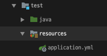
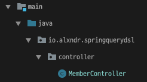
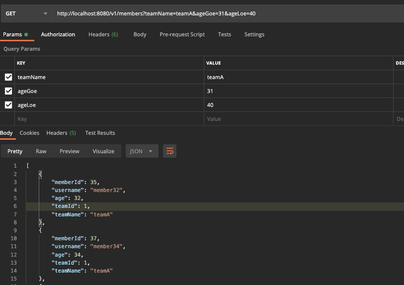

# 조회용 API

회원 조회용 API를 만들겠습니다.   
우선 Test와 local의 분리를 위해 
yml 파일을 분리합니다.

- /main/resources/application.yml
```yml
spring:
  profiles:
    active: test
  datasource:
    url: jdbc:h2:tcp://localhost/~/querydsl
    username: sa
    password:
    driver-class-name: org.h2.Driver
  jpa:
    hibernate:
      ddl-auto: create
    properties:
      hibernate:
        format_sql: true
        use_sql_comment: true
logging:
  level:
    org.hibernate.SQL: debug
    org.hibernate.type: trace
```

그리고 `test`폴더에 `resources` 폴더를 만들어주고 `main`에 있는 `application.yml`을 복사해주고 profile을 수정합니다.



```yml
spring:
  profiles:
    active: test
  datasource:
    url: jdbc:h2:tcp://localhost/~/querydsl
    username: sa
    password:
    driver-class-name: org.h2.Driver
  jpa:
    hibernate:
      ddl-auto: create
    properties:
      hibernate:
        format_sql: true
        use_sql_comment: true
logging:
  level:
    org.hibernate.SQL: debug
    org.hibernate.type: trace
```
> `spring.profiles.active:test` < 이 부분 변경

## Init Data

서버가 실행될 때 기본데이터를 insert해주기위함 입니다.

- InitMember.java
```java
@Profile("local")
@Component
@RequiredArgsConstructor
public class InitMember {

    private final InitMemberService initMemberService;

    @PostConstruct
    public void init() {
        initMemberService.init();
    }

    @Component
    static class InitMemberService {

        @PersistenceContext
        private EntityManager em;

        @Transactional
        public void init() {
            Team teamA = new Team("teamA");
            Team teamB = new Team("teamB");
            em.persist(teamA);
            em.persist(teamB);

            for (int i = 0; i < 100; i++) {
                Team selectedTeam = i % 2 == 0 ? teamA : teamB;
                em.persist(new Member("member" + i, i, selectedTeam));
            }
        }
    }
}
```
> `@Profile('local')` : local이라는 설정파일일때만실행됨.  
> `init()` 과 `InitMemberService.init()`을 굳이 분리한 이유는 스프링 라이프사이클때문에 `@PostConstruct`와 `@Transactional`을 분리하기 위함
---

그리고 API를 위해 `Controller`를 만들어줍니다.   

- MemberController.java
```java
@RestController
@RequiredArgsConstructor
public class MemberController {

    private final MemberJpaRepository memberJpaRepository;


    @GetMapping("/v1/members")
    public List<MemberTeamDto> searchMEmbersV1(MemberSearchCondition condition) {
        return memberJpaRepository.searchByWhere(condition);
    }
}
```

PostMan으로 호출해보면 아래와 같습니다.

- 결과
