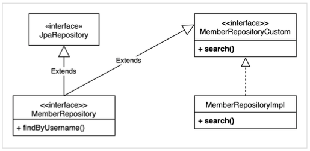

# Spring Data JPA with Querydsl


```java
public interface MemberRepository extends JpaRepository<Member, Long> {
    List<Member> findByUsername(String username);
}
```

## 사용자 정의 레포지토리

 - 출처: [Querydsl-실전](https://www.inflearn.com/course/Querydsl-%EC%8B%A4%EC%A0%84)

새로운 interface를 만든다. (이름은 크게 상관없다.)
- MemberRepositoryCustom.java
```java
public interface MemberRepositoryCustom {
    List<MemberTeamDto> search(MemberSearchCondition condition);
}
```
그리고 `MemberRepositoryCustom`을 구현할 클래스를 만든다.

- MemberRepositoryImpl.java
> ### 주의: 여기서 이름을 `레포지토리명 + Impl` 로 해줘야한다.
`MemberRepositoryCustom`을 상속하여 구현한다.
```java
@RequiredArgsConstructor
public class MemberRepositoryImpl implements MemberRepositoryCustom {

    private final JPAQueryFactory queryFactory;

    @Override
    public List<MemberTeamDto> search(MemberSearchCondition condition) {

        return queryFactory
                .select(new QMemberTeamDto(
                    member.id.as("memberId"),
                    member.username,
                    member.age,
                    team.id.as("teamId"),
                    team.name.as("teamName")))
                .from(member)
                .leftJoin(member.team, team)
                .where(
                    usernameEq(condition.getUsername()),
                    teamNameEq(condition.getTeamName()),
                    ageGoe(condition.getAgeGoe()),
                    ageLoe(condition.getAgeLoe()))
                .fetch();
    }

    private BooleanExpression ageLoe(Integer ageLoe) {
        return ageLoe != null ? member.age.loe(ageLoe) : null;
    }

    private BooleanExpression ageGoe(Integer ageGoe) {
        return ageGoe != null ? member.age.goe(ageGoe) : null;
    }

    private BooleanExpression teamNameEq(String teamName) {
        return hasText(teamName) ? team.name.eq(teamName) : null;
    }

    private BooleanExpression usernameEq(String username) {
        return hasText(username) ? member.username.eq(username) : null;
    }
}
```

그 다음 위에 이미지처럼 
- MemberRepository.java
```java
public interface MemberRepository extends JpaRepository<Member, Long>, MemberRepositoryCustom {
```
`MemberRepositoryCustom` 을 상속해주면,
`Spring Data JPA`와 `Querydsl`을 같이 사용할 수 있게됩니다.