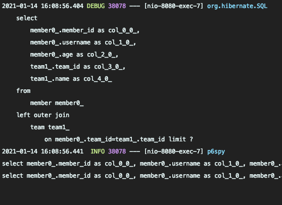

# Querydsl Member Api

- MemberController.java
```java
@RestController
@RequiredArgsConstructor
public class MemberController {

    ...
    ...
    private final MemberRepository memberRepository;

    ... 
    ...
    @GetMapping("/v2/members")
    public Page<MemberTeamDto> searchMEmbersV2(MemberSearchCondition condition, Pageable pageable) {
        return memberRepository.searchWithPageSimple(condition, pageable);
    }

    @GetMapping("/v3/members")
    public Page<MemberTeamDto> searchMEmbersV3(MemberSearchCondition condition, Pageable pageable) {
        return memberRepository.searchWithPageComplex(condition, pageable);
    }

}
```

> API를 만들고 Postman으로 호출해본다.   


조건에 맞는경우 count쿼리가 실행되지 않는 점도 확인해본다.

