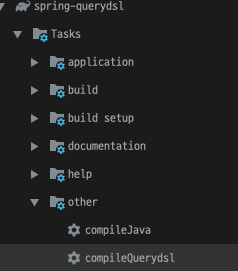

# JPQL vs Querydsl

앞에서 만든 Entity로 QType 생성



새로운 테스트 클래스 생성
- QuerydslBasicTest.java
```java
@SpringBootTest
@Transactional
public class QuerydslBasicTest {

    @Autowired
    EntityManager em;

    JPAQueryFactory queryFactory;

    @BeforeEach
    public void before() {
        queryFactory = new JPAQueryFactory(em); // 동시성 문제 해결됩니다.

        Team teamA = new Team("TEAM A");
        Team teamB = new Team("TEAM B");
        em.persist(teamA);
        em.persist(teamB);

        Member member1 = new Member("member1", 10, teamA);
        Member member2 = new Member("member2", 20, teamA);

        Member member3 = new Member("member3", 30, teamB);
        Member member4 = new Member("member4", 40, teamB);

        em.persist(member1);
        em.persist(member2);
        em.persist(member3);
        em.persist(member4);
    }


    @Test
    public void startJPQL() throws Exception {
        // given
        String query = "select m from Member m where m.username = :username";
        Member findMember = em.createQuery(query, Member.class)
                .setParameter("username", "member1")
                .getSingleResult();
        // when

        // then
        assertThat(findMember.getUsername()).isEqualTo("member1");
    }


    @Test
    public void startQuerydsl() throws Exception {
       
        QMember m = new QMember("m");

        // when
        Member findMember = queryFactory.selectFrom(m)
                .where(m.username.eq("member1"))
                .fetchOne();

        // then
        assertThat(findMember.getUsername()).isEqualTo("member1");
    }

}
```

> EntityManager 로 JPAQueryFactory 생성  
> Querydsl은 JPQL 빌더  
> JPQL: 문자(실행 시점 오류), Querydsl: 코드(컴파일 시점 오류)    
> JPQL: 파라미터 바인딩 직접, Querydsl: 파라미터 바인딩 자동 처리